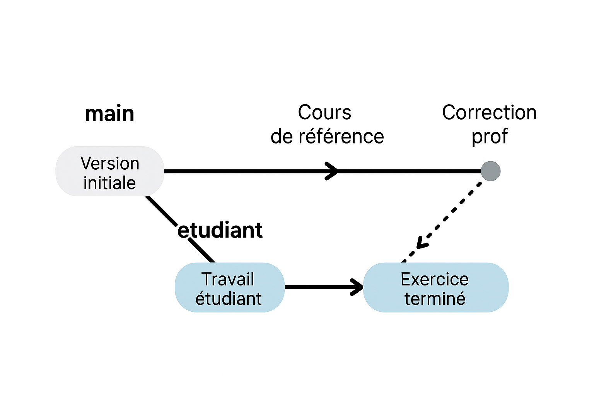

# Tutoriel Git pour le cours de C++ 
*durée approximative* 1 heure


## Introduction à Git et GitHub

Git est un **logiciel de gestion de versions** créé en 2005 par Linus Torvalds (aussi créateur de Linux).
C’est un outil qui permet de suivre l’évolution des fichiers, de revenir à une version précédente et de travailler à plusieurs sans écraser le travail des autres.
Chaque modification est enregistrée dans un **commit** qui garde la trace de *qui a changé quoi et quand*.
Git fonctionne en local : vous avez une copie complète de l’historique du projet sur votre machine.
On peut créer des **branches** pour expérimenter ou travailler en parallèle, puis les fusionner ensuite.
C’est l’outil standard de la programmation moderne, utilisé dans l’industrie comme dans la recherche.
GitHub est un service en ligne (aujourd’hui propriété de Microsoft) qui permet d’héberger des dépôts Git et de collaborer via Internet.
Il offre des fonctionnalités sociales (issues, pull requests, discussions) qui facilitent le travail en équipe.
Dans ce cours, nous utiliserons Git uniquement en local pour gérer vos exercices.
GitHub n’est pas indispensable on peut faire tout les TP sans lui.

## Objectifs de ce TD
Dans ce TD, vous allez apprendre à utiliser Git pour :
* **Récupérer** les fichiers du cours mis à disposition par l’enseignant,
* **Créer votre propre branche** afin d’y écrire vos réponses sans modifier le travail original,
* **Enregistrer vos avancées** régulièrement grâce à des *commits*,
* **Mettre à jour votre dépôt** en intégrant les corrections ou ajouts publiés par l’enseignant.


**Important** : Vous n’avez **pas besoin de compte GitHub**.
Vous ne pourrez **pas pousser (`push`)** vos modifications sur le dépôt de l'enseignant car tout se fait **en local** sur votre machine.

---

## Étape 1 : Installer Git

Git est un logiciel disponible sur la plupart des systèmes d’exploitation.
Le point de départ est donc son installation.

Si vous souhaitez l’installer sur votre PC personnel, voici les commandes à utiliser :

* **Linux (Ubuntu/Debian)** :

  ```bash
  sudo apt install git
  ```
* **macOS** (via Homebrew) :

  ```bash
  brew install git
  ```

Sur les PC disponibles en salle de TP, **Git est déjà installé** : vous n’avez donc rien à faire.

---

## Étape 2 : Cloner le dépôt du cours

Un dépôt Git **en lecture seule** est mis à votre disposition.
Exemple :

```bash
git clone https://github.com/monprof/cpp-cours.git
```

Cette commande permet de créer une copie locale (*clone*) du dépôt sur votre machine.
Cela crée un dossier `cpp-cours/` contenant tous les fichiers du td en cours.

---

## Étape 3 : Créer votre branche personnelle


L’idée d’une **branche** est de séparer votre travail du code principal (`main`).
Chaque étudiant dispose ainsi de son espace de travail indépendant :

* vos modifications restent isolées,
* vous pouvez expérimenter sans risque d’altérer le contenu original,
* vous pouvez facilement mettre à jour votre branche avec les corrections de l’enseignant.

En pratique :


Ce diagramme illustre :

* la branche `main` qui contient le cours et les corrections,
* la branche `etudiant` où vous travaillez,
* et la possibilité de **fusionner (`merge`) les corrections** de `main` dans votre branche.


## Étape 4 : Travailler sur les exercices

1. Ouvrez les fichiers dans votre éditeur (VSCode, etc.).
2. Répondez aux exercices.
3. Sauvegardez vos modifications avec Git :

```bash
git add fichier1.cpp fichier2.cpp 
git commit -m "Réponse à l'exercice 1 et 2"
```
Cela enregistre vos réponses dans l’historique Git **local**.

## Étape 5 : Récupérer les corrections

Lorsque le dépôt principale est mis à jour (corrections, nouveaux exercices), faites :

```bash
git checkout main      # switch sur la branche locale du prof 
git pull origin main   #  synchornisation avec le depot distant
```

Puis fusionnez les corrections dans votre branche personnelle :

```bash
git checkout prenom # revenir sur la branche
git merge main      # fusionner avec les correction locale 
```

Vous gardez vos réponses ET récupérez les corrections.

---

## Pourquoi pas de `push` ?

Le dépôt du professeur est en **lecture seule**.
Cela veut dire que vous **ne pouvez pas** faire :

```bash
git push
```

Si vous essayez, Git retournera une erreur.
C’est normal et volontaire : vous travaillez **localement**.


## Résumé

* `git clone` → télécharger le cours et les énoncés.
* `git checkout -b prenom` → créer votre branche perso.
* `git add` + `git commit` → enregistrer vos réponses.
* `git pull` + `git merge` → récupérer les corrections.
* `git push` → interdit (vous n’avez pas les droits).


Avec ça, chaque étudiant garde ses réponses localement, peut récupérer les corrections facilement, et personne ne risque d’écraser le dépôt du prof.


[exercice](./enonce/enonce.md)
